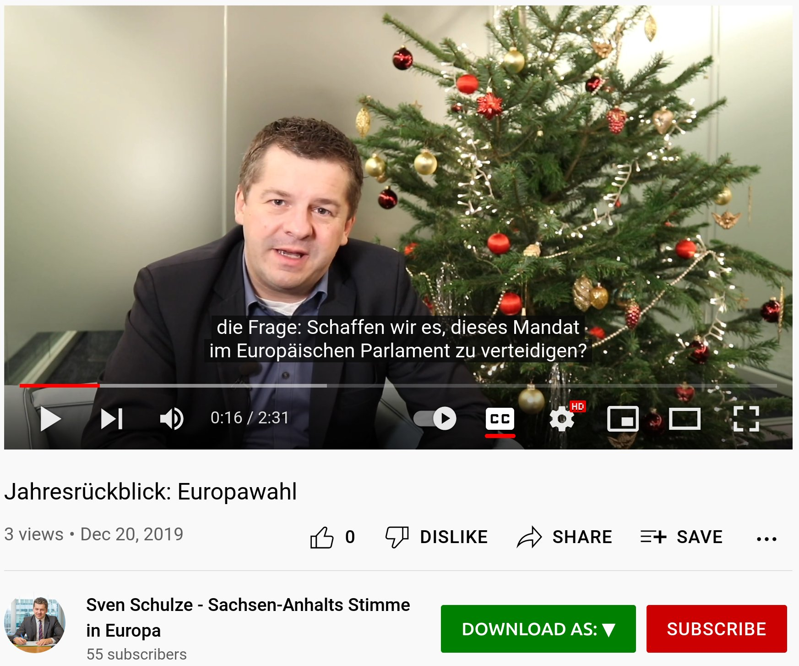

# youtube-audio-data

finding/filtering/getting audio data from youtube

### legal aspects
["YouTube has never sued anyone for downloading content."](https://www.makeuseof.com/tag/is-it-legal-to-download-youtube-videos/)

### current state
* scraped a small collection of youtube-channels for their meta-data (no audio, no videos)
#### number of videos per channel
* number of videos per channel (somewhen around december 2021, january 2022)
* counted are "info-jsons" downloaded by yt-dlp
* list of channels is just a manual selection, there are way more (interesting ones) not yet scraped!

```shell
du -a | rg "\.json" | cut -d/ -f2 | sort | uniq -c | sort -nr
  96380 c_euronewsfr
  89834 user_TEDxTalks
  71529 user_noticiascaracol
  66837 user_RTIOFFICIEL
  41535 user_rtrussian
  32453 user_phoenix
  30232 user_DeutscheWelleEspanol
  23843 user_NoticiasUnoColombia
  23618 c_TV5MONDEInfo
  21760 user_tv5monde
  20442 user_deutschewelle
  16088 c_aljazeeraenglish
  15776 user_Elespectadorcom
  15241 user_tagesschau
  15127 user_bbcnews
  14738 user_france24
  11691 user_deutschewellerussian
   8795 user_deutschewelleenglish
   8124 user_spiegeltv
   8022 c_CanalMyNews
   7652 c_bayerischerrundfunk
   7640 c_BR24
   7593 user_BBC
   6441 user_ArchivoNoticiasUno
   6136 user_BBCRussian
   5148 user_hrfernsehen
   4279 c_BBCMundo
   3863 c_derStandardat
   3852 c_extra3
   3422 user_ARD
   3145 user_SWR
   3080 c_ZDFheute
   2748 user_TEDtalksDirector
   2315 user_meinMDRFernsehen
   2240 c_mdr
   1937 user_srfkultur
   1787 c_srf
   1719 c_ORFFanHD
   1580 user_TracksARTEde
   1546 user_VanityFairMagazine
   1354 c_KURIERatWeb
   1352 user_voxdotcom
   1302 c_artede
   1223 user_WDRchannel
   1175 c_ZDFMAGAZINROYALE
   1142 c_srfdok
    988 user_ndr
    980 c_NDRDoku
    952 c_france3na
    942 c_heuteshow
    903 channel_UCFoKXoDoExwtBWdSTCIdEVQ
    763 user_sfarchiv
    757 user_rbb
    711 c_DWDocumentary
    693 puls
    585 user_walulissiehtfern
    557 c_gouvernementfr
    522 c_TV5MONDEAfrique
    522 c_terra-x
    407 c_WDRDoku
    388 c_BrowserBallett
    367 c_LaPulla
    317 c_terraxleschundco
    300 c_ykollektiv
    291 c_MDRDOK
    265 c_MDRInvestigativ
    263 c_DieFrage
    257 c_ZDF
    246 c_DRUCKDieSerie
    243 c_ZDFbesseresser
    219 c_followmereports
    214 c_germania
    202 c_aufklo
    194 c_STRGF
    125 c_redfishstream
    124 c_TEDEspanol
    111 c_scobel
     60 c_37Grad
     40 c_FunkOfficial
     31 c_DerFall
     29 user_vicenews
     28 c_ZDFwiso
      9 c_frontal

```
#### number of manually created (hopefully by human) subtitles per channel
* counts of `vtt`-files written by `--all-subs` arg of yt-dlp
* seems `--all-subs` is not really downloading ALL subtitles, but just manually created one (excluding youtube-generated ones)
* quality of subtitles completely upto the users/channels -> needs to be estimated somehow
```shell
du -a YOUTUBE_info_jsons | rg "\.vtt" | cut -d/ -f2 | sort | uniq -c | sort -nr
  15981 user_TEDxTalks
  11609 user_noticiascaracol
   2673 user_TEDtalksDirector
   2503 c_BR24
   2337 c_extra3
   1734 user_hrfernsehen
   1649 user_Elespectadorcom
   1239 user_voxdotcom
   1136 c_bayerischerrundfunk
    849 user_ndr
    831 c_NDRDoku
    659 c_derStandardat
    559 user_meinMDRFernsehen
    554 user_BBC
    541 c_mdr
    533 user_ARD
    526 c_srfdok
    522 user_tv5monde
    474 c_BBCMundo
    463 user_WDRchannel
    440 c_terra-x
    403 user_deutschewelleenglish
    391 user_SWR
    346 c_BrowserBallett
    337 c_LaPulla
    334 user_VanityFairMagazine
    296 c_ykollektiv
    272 c_terraxleschundco
    267 user_walulissiehtfern
    253 c_WDRDoku
    246 user_deutschewelle
    238 user_spiegeltv
    210 c_DWDocumentary
    208 c_DieFrage
    205 user_tagesschau
    202 c_followmereports
    192 user_rbb
    187 c_germania
    184 c_aufklo
    180 c_gouvernementfr
    177 c_STRGF
    163 c_aljazeeraenglish
    161 c_DRUCKDieSerie
    152 user_rtrussian
    123 c_TV5MONDEInfo
    122 c_MDRDOK
    114 puls
    100 user_BBCRussian
     91 c_TEDEspanol
     88 c_ZDFMAGAZINROYALE
     86 c_redfishstream
     86 c_MDRInvestigativ
     82 user_bbcnews
     79 user_srfkultur
     65 c_TV5MONDEAfrique
     63 c_ZDFheute
     57 c_ZDFbesseresser
     57 c_srf
     54 user_sfarchiv
     37 c_ZDF
     34 user_TracksARTEde
     30 c_DerFall
     16 c_37Grad
     15 user_DeutscheWelleEspanol
     12 c_ZDFwiso
     11 c_euronewsfr
      9 user_deutschewellerussian
      9 c_FunkOfficial
      9 c_artede
      8 c_heuteshow
      8 c_frontal
      6 user_phoenix
      6 c_CanalMyNews
      5 user_vicenews
      3 c_france3na
      2 user_france24
      2 c_scobel
      2 c_KURIERatWeb
      1 user_RTIOFFICIEL
      1 channel_UCFoKXoDoExwtBWdSTCIdEVQ
```

### workflow -> TODO
* automate the "cycle": 

0. start with some known youtube-channels as initial "seed"
1. scraping channels -> meta-data; 
2. searching youtube with titles from step 0 -> channels
3. goto step 1

#### more detailed
1. [scraping channels](download_metadata_from_youtube_channels.py)
2. [searching youtube](searching_youtube_with_channels.py): getting search-results: by searching youtube with search-phrases
    ```shell
   example search result:
    {
      "id": "BhgCB_F7BFQ",
      "thumbnails": [
        "https://i.ytimg.com/vi/BhgCB_F7BFQ/hq720.jpg?sqp=-oaymwEjCOgCEMoBSFryq4qpAxUIARUAAAAAGAElAADIQj0AgKJDeAE=&rs=AOn4CLDXVB6uVcfBJ5QrT5FyTv1AuNvVgQ",
        "https://i.ytimg.com/vi/BhgCB_F7BFQ/hq720.jpg?sqp=-oaymwEXCNAFEJQDSFryq4qpAwkIARUAAIhCGAE=&rs=AOn4CLB4MCOresAXttKZBZYIP0fKdELmEA"
      ],
      "title": "El Salvador: Kampf gegen den Klimawandel | Global Ideas",
      "long_desc": null,
      "channel": "DW Deutsch",
      "duration": "5:13",
      "views": "2.704 Aufrufe",
      "publish_time": "vor 2 Wochen",
      "url_suffix": "/watch?v=BhgCB_F7BFQ",
      "rank": 0
    }
    ```
3. [scraping subtitles](download_via_yt_dlp_from_urls.py): filter for "good" results + scrape subtitles
   1. [filter_youtube_results](filter_youtube_results.py) for "good" results (by titles language), num likes etc not reliable? 
   2. scraping subtitles
      ```shell
       data/ASR_DATA/YOUTUBE_subtitles# ll |  head
          90464 Jan  5 02:11 $13,950,000 2019 DAMEN YACHT SUPPORT VESSEL 'PINK SHADOW' SuperYacht Toy Hauler Tour [7ymEzBrldlI].ar.vtt
          76773 Jan  5 02:11 $13,950,000 2019 DAMEN YACHT SUPPORT VESSEL 'PINK SHADOW' SuperYacht Toy Hauler Tour [7ymEzBrldlI].de.vtt
         102343 Jan  5 02:11 $13,950,000 2019 DAMEN YACHT SUPPORT VESSEL 'PINK SHADOW' SuperYacht Toy Hauler Tour [7ymEzBrldlI].el.vtt
          74109 Jan  5 02:11 $13,950,000 2019 DAMEN YACHT SUPPORT VESSEL 'PINK SHADOW' SuperYacht Toy Hauler Tour [7ymEzBrldlI].en-US.vtt
          76356 Jan  5 02:11 $13,950,000 2019 DAMEN YACHT SUPPORT VESSEL 'PINK SHADOW' SuperYacht Toy Hauler Tour [7ymEzBrldlI].es.vtt
          78790 Jan  5 02:11 $13,950,000 2019 DAMEN YACHT SUPPORT VESSEL 'PINK SHADOW' SuperYacht Toy Hauler Tour [7ymEzBrldlI].fr.vtt
          76907 Jan  5 02:11 $13,950,000 2019 DAMEN YACHT SUPPORT VESSEL 'PINK SHADOW' SuperYacht Toy Hauler Tour [7ymEzBrldlI].id.vtt
      ```
4. [getting new channels]()
   1. filter+sort potential channels by language + some heuristic quality (of subtitles) measures
5. goto 1.!

### some resources / links
* [youtube_search](https://github.com/joetats/youtube_search/blob/master/youtube_search/__init__.py) very simple
* [youtube-transcript-api](https://github.com/jdepoix/youtube-transcript-api)
* [youtube-search-python](https://github.com/alexmercerind/youtube-search-python) -> more complex, more needed features?
* [youtube-dl](https://github.com/ytdl-org/youtube-dl) -> outdated!! abandoned!! don't use anymore!
* [yt-dlp](https://github.com/yt-dlp/yt-dlp) -> use this one!
* [ard_spider](https://github.com/fabsrc/mediathek_scraper/blob/master/mediathek_scraper/spiders/ard_spider.py)
  * this is no youtube!

```shell
yt-dlp --write-sub --write-info-json --dateafter now-1year --download-archive downloadedarchive.txt -f ba https://www.youtube.com/user/ARD/featured
yt-dlp --write-sub --write-info-json --dateafter now-2year --max-downloads 50 --download-archive downloadedarchive.txt --extract-audio --audio-format mp3 -f ba https://www.daserste.de/unterhaltung/krimi/tatort/videos/index.html
```

### simply filtering by number of views does not work!!
* this video only had 1 view before I found it! even though its "good" content!
